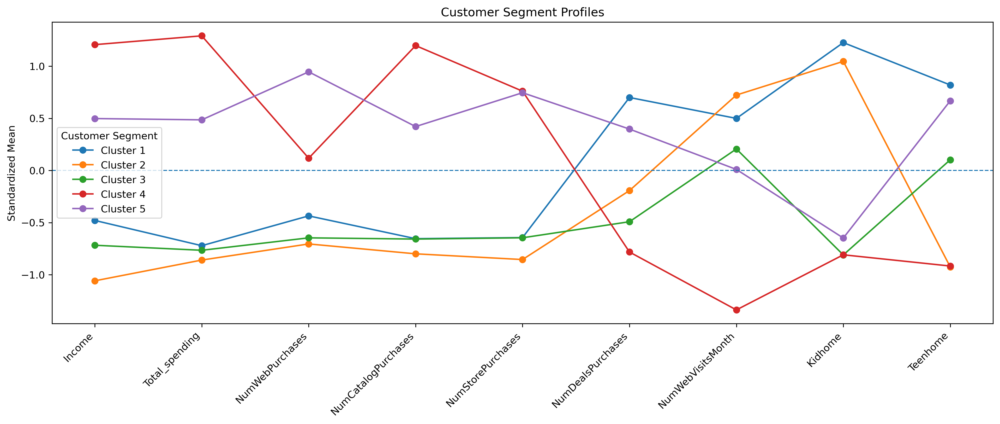

# Customer Segmentation Analysis

## Project overview
This project analyzes customer demographic and purchasing data to identify meaningful customer segments based on differences in purschasing behavior, spending patterns and customer characteristics. The objective is to help the company better understand its customer base and identify which customer segments should be prioritized in marketing activities to increase revenue and customer loyality. 

The analysis focuses on two key areas: 
1. Customer segmentation using hierarchical clustering with Ward's method to identify distinct customer groups
2. Marketing opportunities: Profiling the identified segments to determine which customers are more valuable and responsive to marketing campaigns.

## Dataset
The dataset contains information on 2,240 unique customers, with each row representing an individual customer. The data includes demographic characteristics, purchasing behavior, spending across different product categories and responses to previous marketing campaigns. The variables can be listed in the following categories. 
- **Demographics:** Age, education, Mmrital status, income and children at home. 
- **Purchasing behavior:** Web, catelog and store purchases, deal purchases and website visits.
- **Spending behavior:** Amount spent across product categories such as wine, meat, fruit, fish ect.
- **Marketing response:** Responses and acceptance of previous marketing campaigns.

The dataset was obtained from Kaggle and can be downloaded [here](https://www.kaggle.com/datasets/imakash3011/customer-personality-analysis/data). 

## Executive summary 
The analysis identified 5 distinct customer segments with substantial differences in spending behavior, purchasing channels, household characteristics and responsiveness to marketing campaigns. Overall, the segmentation demonstrates that a differentiated marketing strategy is likely to be more effective than treating all customers the same. 

### Identified Customer Segments

| Segments | Number of customers | Key Characteristics |
|---|---|---|
| **Cluster 1 – Discount Shoppers** | 424 | High use of discounts and many children at home |
| **Cluster 2 – Low-Value Customers** | 432 | Lowest income and spending, young customers and frequent website visitors |
| **Cluster 3 – Marketing-Resistant Customers** | 255 | Low response to marketing campaigns and many households with teenagers |
| **Cluster 4 – High-Value Customers** | 436 | Highest income and spending, strong store/catalog purchasing and highest campaign response |
| **Cluster 5 – Active Online Customers** | 637 | Highest web purchasing activity and relatively high campaign response |

### Targeting recommendations 

**Cluster 1 – Discount Shoppers:** This segment appears highly price-sensitive and responds well to discounts. Future campaigns should focus on promotions, coupons and bundle offers to encourage repeat purchases while avoiding unneccessary discounts on premium products.

**Cluster 2 – Low-Value Customers:** This segment shows high online engagement but low purchasing activity. They therefore appear interested in the company's products, but they rarely convert into purchases. The company should focus on converting these visitors into customers through personalized offers, entry-level products and targeted promotions.

**Cluster 3 – Marketing-Resistant Customers:** This segment is the least responsive to marketing campaigns. Rather than increasing campaigns frequency, the company should test alternative messages, channels or offers to better understand what motivates these customers.

**Cluster 4 – High-Value Customers:** This segment appear to be the top spending segment and are the one that responds the most positive in regard to marketing campaigns. They make fewer but larger purchases. They represent the company's most valuable customers. Marketing efforts should focus on retaining these customers through exclusive offers, premium products and loyality programs rather than frequent discount campaigns.

**Cluster 5 – Active Online Customers:** These customers appear highly engaged with the company's online channels and they respond well to marketing campaigns. Future digitally marketing campaigns and perhaps loyality iniatitives should therefore prioritize this segment. 
